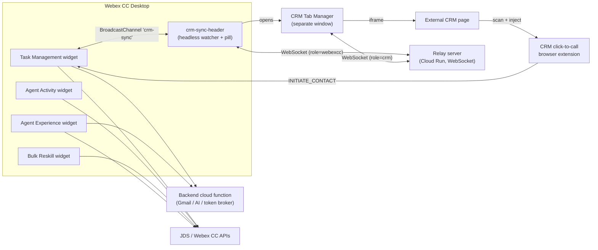

# Webex Contact Center Widget Suite

A collection of Webex Contact Center (WxCC) Desktop widgets, a supporting relay
server, a CRM browser extension, and a backend cloud function. The suite helps
agents and supervisors manage tasks, focus on SLA‑critical work, integrate with
external CRMs, analyze activity, and reskill teams in bulk.

Everything is built with React, Redux Toolkit, and Momentum UI, and each widget
ships as a self‑contained Web Component (shadow DOM) that can be dropped into a
Desktop Layout.

---

## What's in the box

| Component | What it is | Docs |
|---|---|---|
| **Task Management widget** | Agent widget for cases, email, chat, voice, unified customer view, and AI hints | [docs/task-management-widget.md](docs/task-management-widget.md) |
| **SLA Focus Mode** | Auto‑sets the agent Not Available while SLA‑critical tasks are open; per‑channel scope; end‑of‑shift requeue | [docs/sla-focus-mode.md](docs/sla-focus-mode.md) |
| **CRM integration** | Header watcher, relay server, CRM Tab Manager, and click‑to‑call browser extension | [docs/crm-integration.md](docs/crm-integration.md) |
| **Agent Activity Analytics widget** | Supervisor timeline + KPI view of agent/team activity | [docs/agent-activity-widget.md](docs/agent-activity-widget.md) |
| **Bulk Reskilling widget** | Supervisor tool to edit agent skills / skill‑profiles at scale | [docs/bulk-reskill-widget.md](docs/bulk-reskill-widget.md) |
| **Agent Experience widget** | Supervisor tool for team‑scoped email templates, signatures, and AI proofreading prompts | [docs/agent-experience-widget.md](docs/agent-experience-widget.md) |
| **Backend cloud function** | Inbound email processing, Gmail watch, token broker, AI enrichment, Agent Experience config, voice‑transcript proxy, and a scheduled web crawler feeding a Vertex AI Search data store (Gemini RAG) | [docs/backend.md](docs/backend.md) |
| **Development & deployment** | Build targets, artifacts, i18n, design tokens, testing, repo layout | [docs/development.md](docs/development.md) |

> Screenshots referenced throughout the docs live in [docs/images/](docs/images/).
> See [docs/images/README.md](docs/images/README.md) for the capture checklist.

---

## Architecture at a glance



---

## Quick start (Task Management widget)

```bash
npm install
npm start                  # dev harness at http://localhost:8080
npm test                   # Jest unit tests
npm run build:standalone   # self-contained bundle for Desktop deployment
```

Build targets, artifact names, and deployment steps for **every** widget are in
[docs/development.md](docs/development.md).

---

## Key architectural rules

- All async work (SDK, API, JDS) goes through Redux thunks — never called directly from components.
- The API layer contains pure async functions only; no Redux logic.
- All user‑facing strings are i18n‑key based; no hardcoded text in components.
- Layout and spacing use `--tm-*` / Momentum design tokens; no hardcoded px in widget CSS.
- Widgets must work in **demo mode** without the Desktop SDK.
- Redux state stays serializable; non‑serializable SDK handles are kept in module scope.

See [docs/development.md](docs/development.md) and
[src/ui/design-guide.md](src/ui/design-guide.md) for the full contributor guide.

---

## License

Private — Webex Contact Center customization project.

