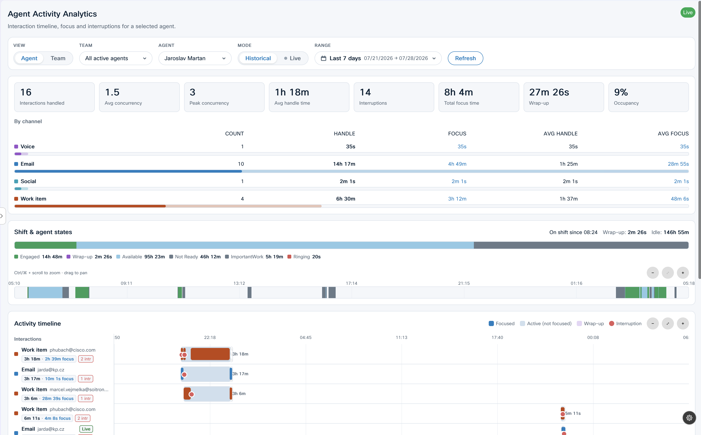
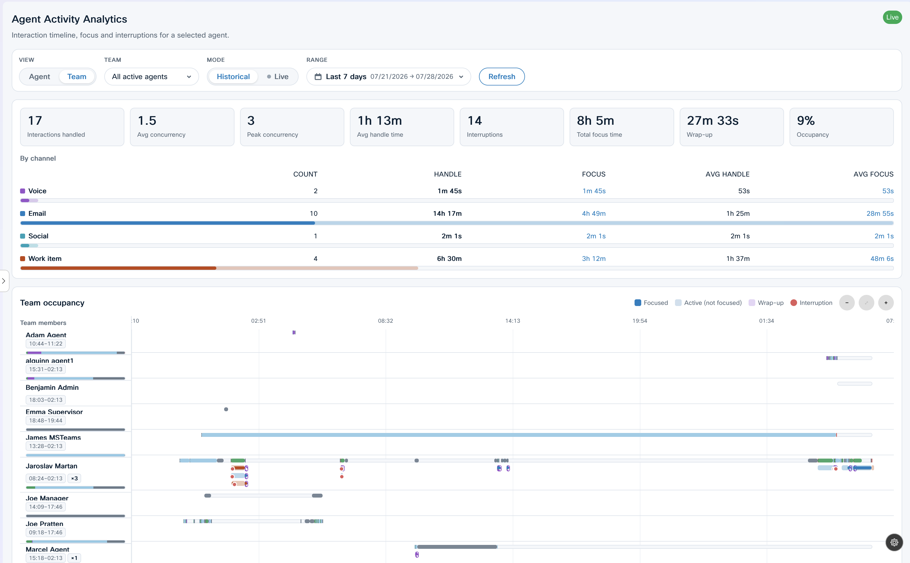

# Agent Activity Analytics Widget

A supervisor‑facing analytics widget that visualizes a selected agent's — or an
entire team's — interaction timeline, work states, focus periods, and KPIs over a
configurable time range.

- **Web Component tag:** `agent-activity-widget`
- **Entry:** [src-report/index.jsx](../src-report/index.jsx)
- **Standard artifact:** `dist/agent-activity.js`
- **Standalone artifact:** `dist/agent-activity-standalone.js`
- **Dev harness:** [dev-report.html](../dev-report.html)




---

## What it does

Supervisors pick a team and (optionally) a single agent, choose a time range
(1h / 8h / 24h / today / custom, etc.), and toggle between historical and live
modes. The widget derives metrics from event‑log activity and, when available,
Webex CC agent‑state (AAR) data.

Orchestrator: [src-report/components/ActivityReport.jsx](../src-report/components/ActivityReport.jsx).

### Main areas

| Area | Component | Shows |
|---|---|---|
| Controls bar | (in `ActivityReport`) | Scope toggle (agent/team), team & agent pickers, mode (historical/live), range selector. |
| Overview KPIs | [ActivityOverviewBar.jsx](../src-report/components/ActivityOverviewBar.jsx) | Interactions handled, avg/peak concurrency, AHT, interruptions, focus time, wrap‑up time, occupancy %, and a per‑channel breakdown. |
| Agent state | [AgentStatePanel.jsx](../src-report/components/AgentStatePanel.jsx) | Stacked state‑distribution bar (engaged, wrap‑up, available, idle, break…). |
| Activity timeline | [ActivityTimeline.jsx](../src-report/components/ActivityTimeline.jsx) | Swim‑lane per interaction with active span, focused segments, wrap‑up tail, interruption markers; zoom/pan; live now‑marker. |
| Team timeline | [TeamTimeline.jsx](../src-report/components/TeamTimeline.jsx) | One row per agent with packed sub‑lanes for overlapping interactions + occupancy. |

---

## State & data

Single Redux slice: `src-report/store/slices/activitySlice.js`. Key fields include
Desktop context (`accessToken`, `orgId`, `datacenter`, `activityUrl`, `darkMode`,
`forcedMode`), selection (`selectedTeamId`, `selectedAgentId`, `scope`), view
controls (`mode`, `rangeKey`, `customFrom/To`), and data (`events[]`,
`agentState`, `teamState[]`).

Thunks handle all async work: `hydrateContext`, `loadTeams`, `loadAgents`,
`loadAgentEvents`, `loadTeamEvents`, `loadAgentState`, `loadTeamState`,
`createLiveSubscription`, `refresh`, `teardown`. The live subscription handle is
kept in module scope so Redux state stays serializable.

### Data sources ([src-report/api.js](../src-report/api.js))

- **Live** (when `activityurl` is provided): a Cloud Function activity endpoint
  (`?teams=1`, `?agents=1&from&to&teamId`, `?agentId&from&to`), the Webex CC
  Config API for team/agent metadata, and an agent‑state (AAR) endpoint.
- **Demo** (no `activityurl`): deterministic fixtures/generators in
  [src-report/mock/](../src-report/mock/).

### Transforms

- KPI aggregation: [src-report/analytics.js](../src-report/analytics.js)
- Timeline model: [src-report/timeline.js](../src-report/timeline.js)
- Team packing: [src-report/team.js](../src-report/team.js)
- State merge: [src-report/stateModel.js](../src-report/stateModel.js)
- Viewport/zoom: [src-report/useViewport.js](../src-report/useViewport.js)
- Formatting: [src-report/format.js](../src-report/format.js)

---

## Props

`accesstoken`, `orgid`, `datacenter`, `activityurl`, `darkmode`, `view`
(`mock` | `live`), `locale`.

---

## i18n

Dictionaries in [src-report/i18n/translations.js](../src-report/i18n/translations.js);
supported locales **en**, **de**, **cs** (browser detection + `?locale=` override).

---

## Build & deploy

```bash
npm run start:report               # dev harness
npm run build:report               # → dist/agent-activity.js
npm run build:report:standalone    # → dist/agent-activity-standalone.js
```

See [development.md](development.md) for layout wiring.
