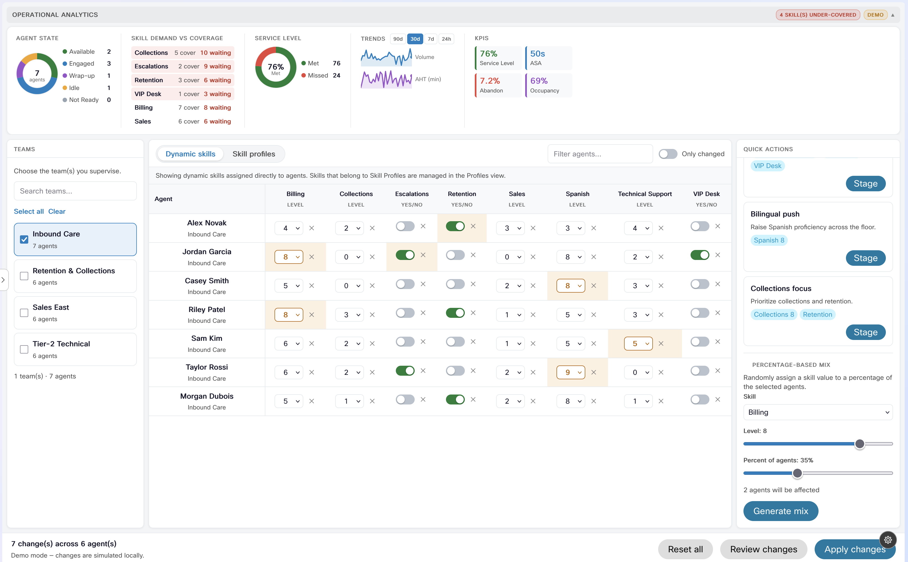
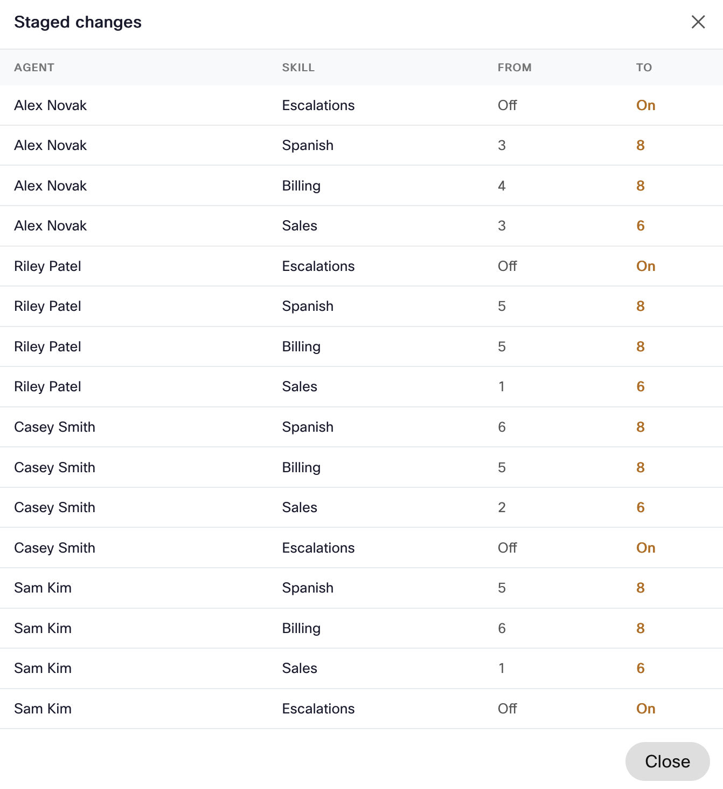

# Bulk Reskilling Widget

A supervisor tool for managing Webex CC agent skill assignments at scale.
Supervisors select teams, then either edit **dynamic skills** directly on agents
(assign / change value / remove) or assign & unassign **skill profiles** in bulk,
stage the changes, review them, and apply them to live Webex CC configuration.

- **Web Component tag:** `bulk-reskill-widget`
- **Entry:** [src-reskill/index.jsx](../src-reskill/index.jsx)
- **Main component:** [src-reskill/BulkReskill.jsx](../src-reskill/BulkReskill.jsx)
- **Standard artifact:** `dist/bulk-reskill.js`
- **Standalone artifact:** `dist/bulk-reskill-standalone.js`
- **Dev harness:** [dev-reskill.html](../dev-reskill.html)




---

## What it does

Two editing modes, switched with a Momentum-style segmented pill toggle
([ViewModeToggle.jsx](../src-reskill/components/ViewModeToggle.jsx)):

1. **Dynamic skills** — a per-agent editor that lists **only dynamic skills**
   (Webex CC skills whose `dynamicSkill` attribute is `true`, i.e. those that can
   be assigned directly to agents). Each cell can **assign** the skill, **change
   its value** (proficiency 0–10, boolean toggle, enum, text), or **remove** it
   from the agent. Non-dynamic skills are delivered through skill profiles and are
   handled in the other mode.
2. **Skill profiles** — assign a skill profile to agents in bulk or per agent,
   or **unassign** it (“No profile”), using a searchable pill combo box.

An analytics bar shows agent-state distribution, per-skill demand vs coverage,
service level, and trends. Changes are staged as drafts and applied only after a
review step.

### Main areas

| Area | Component | Purpose |
|---|---|---|
| Analytics bar | [AnalyticsBar.jsx](../src-reskill/components/AnalyticsBar.jsx) | Agent-state donut (click to filter), skill demand vs coverage, trend sparklines, KPI tiles, demo/live toggle. |
| Team selector | [TeamSelector.jsx](../src-reskill/components/TeamSelector.jsx) | Multi-select supervised teams with agent counts + search. Agents are matched on **any** of their teams (Webex CC users can belong to multiple teams). |
| Dynamic-skill grid | [SkillMatrix.jsx](../src-reskill/components/SkillMatrix.jsx) | Editable agents × dynamic-skills grid; each cell assigns / edits / removes a skill; toggle switches for booleans; “only changed” filter; pending-change highlighting. |
| Profiles view | [ProfilesView.jsx](../src-reskill/components/ProfilesView.jsx) | Current profile per agent + bulk assign / unassign via a searchable combo (“No profile” pinned first) + scenario presets. |
| Quick actions | [QuickActions.jsx](../src-reskill/components/QuickActions.jsx) / [ProfileQuickActions.jsx](../src-reskill/components/ProfileQuickActions.jsx) | Template presets + percentage-based bulk generation. |
| Review dialog | [ReviewDialog.jsx](../src-reskill/components/ReviewDialog.jsx) | Tabular agent / skill / from → to (incl. “Removed” / “No profile”) before applying. |
| Toolbar | [ReskillToolbar.jsx](../src-reskill/components/ReskillToolbar.jsx) | Pending count, reset, review, apply (confirm dialog for live writes). |
| Shared UI | [SearchableSelect.jsx](../src-reskill/components/SearchableSelect.jsx) / [ToggleSwitch.jsx](../src-reskill/components/ToggleSwitch.jsx) | Momentum pill combo box (embedded search, keyboard nav, shadow-DOM safe) and pill toggle switch. |

---

## State & data

Single Redux slice: `src-reskill/store/slices/reskillSlice.js`. Holds lifecycle
(`status`, `applying`, `applyResult`), Desktop context, config (`skills`,
`teams`, `agents`, `skillProfiles`), UI selection, analytics, and two staged
drafts: `draft` (per-skill overrides, keyed agent → skill → value) and
`profileDraft` (profile assignments). Removal is staged with sentinels from
[src-reskill/constants.js](../src-reskill/constants.js): `REMOVE_SKILL` (drop a
dynamic skill) and `NO_PROFILE` (unassign a skill profile).

Selectors: [src-reskill/selectors.js](../src-reskill/selectors.js)
(`effectiveValue`, `isChanged`, `agentsForTeams`, `agentTeamIds`, `filterAgents`,
`dynamicSkills`, `stagedChangeRows`, `stagedProfileRows`, `stagedSummary`, …).
`dynamicSkills` filters the catalog to `skill.dynamic` (from `dynamicSkill`) and
sorts A→Z; `agentTeamIds` returns an agent’s full team list.

Thunks: `initReskillWidget`, `loadConfig`, `loadAnalytics`, `applyChanges`,
`setDataMode`.

### Data sources ([src-reskill/api.js](../src-reskill/api.js))

- **Live** (with `accessToken` + `orgId` + `datacenter`): Webex CC Configuration
  APIs — `GET .../team`, `.../user`, `.../skill`, `.../skill-profile` (paginated),
  with regional base auto-discovery. `normalizeConfig` maps each skill’s
  `dynamicSkill` flag, reads each agent’s directly-assigned values from
  `user.dynamicSkills[]`, and keeps the agent’s full `teamIds` array.
- **Apply** (`applyReskillChanges`, safe read-modify-write per user):
  - Dynamic-skill edits → `GET .../user/{id}`, upsert / delete entries in
    `user.dynamicSkills[]` (value field per type: proficiency / boolean / text /
    enum id), then `PUT` the full user back.
  - Profile assign / unassign → `PUT .../user/{id}` with `skillProfileId` set (or
    `null` to unassign). Live writes require the `cjp:config_write` scope.
- **Demo**: deterministic fixtures in [src-reskill/mock/](../src-reskill/mock/).
- **Live analytics**: Search API (agent-state distribution, coverage, SL/ASA/
  abandon, volume/AHT trends), refreshed while the analytics bar is open.

---

## Props

`accesstoken`, `orgid`, `datacenter`, `darkmode`, `view` (`mock` | `live`),
`locale`.

---

## i18n

Dictionaries in [src-reskill/i18n/translations.js](../src-reskill/i18n/translations.js);
supported locales **en**, **de**, **cs** (browser detection + `?locale=` override).

---

## Build & deploy

```bash
npm run start:reskill               # dev harness
npm run build:reskill               # → dist/bulk-reskill.js
npm run build:reskill:standalone    # → dist/bulk-reskill-standalone.js
```

See [development.md](development.md) for layout wiring.
