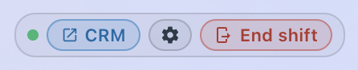
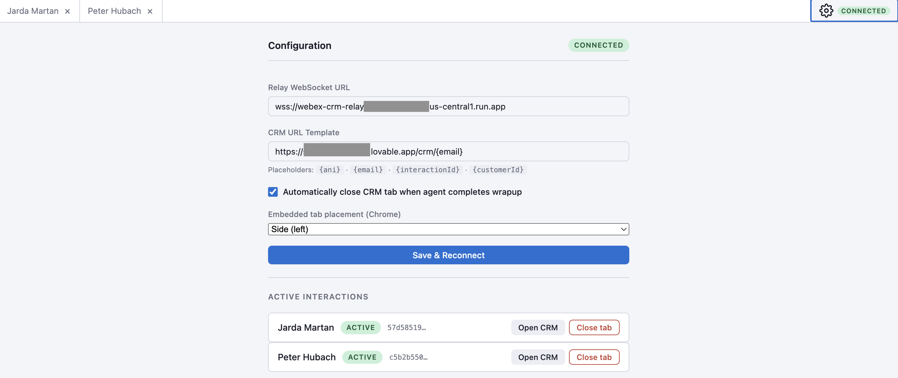
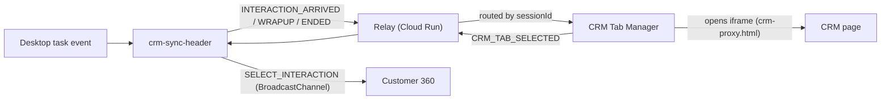

# CRM Integration

This suite integrates the Webex CC Desktop with an external CRM through four
cooperating pieces:

| Piece | Location | Runs where |
|---|---|---|
| **Header watcher / pill** | [src/crm-sync-header.js](../src/crm-sync-header.js) | Headless component in the Desktop `advancedHeader`. |
| **Relay server** | [relay-server/](../relay-server/) | Google Cloud Run (WebSocket + static files). |
| **CRM Tab Manager** | [crm-tab-manager/](../crm-tab-manager/) | Separate browser window served by the relay. |
| **Click‑to‑call extension** | [crm-clicktocall-extension/](../crm-clicktocall-extension/) | MV3 browser extension injected into CRM pages. |




---

## End‑to‑end flow



Tasks flowing from the Desktop are forwarded to the Tab Manager, which opens the
matching CRM page. Selecting an interaction in the Tab Manager drives the Desktop
to switch to that task.

---

## 1. Header watcher / pill (`src/crm-sync-header.js`)

A dependency‑free IIFE deployed as a static script from the relay and loaded into
the Desktop layout's `advancedHeader`. Responsibilities:

- **Relay WebSocket** as `role='webexcc'` — registers with a `sessionId` +
  access token, auto‑reconnects (~5s), heartbeats (~30s).
- **Task lifecycle forwarding** — watches the `task` property and sends
  `INTERACTION_ARRIVED` / `INTERACTION_WRAPUP` / `INTERACTION_ENDED` /
  `TASK_TITLE` / `INTERACTION_SELECTED` to the Tab Manager.
- **Customer email resolution** — resolves a canonical email via JDS person
  aliases so voice + email for the same person share one CRM tab.
- **SLA focus mode + end‑of‑shift requeue** — see [SLA Focus Mode](sla-focus-mode.md).
- **CRM Tab Manager window** — `window.open(url, windowName)` (a normal tab, so it
  can be dragged to a second monitor); Open/Focus + Settings buttons in the pill.
- **Relay status pill** — a connected/disconnected dot, theme‑adaptive.

### Layout integration (example)

```json
{
  "comp": "crm-sync-header",
  "script": "https://<relay-host>/dist/crm-sync-header.js",
  "properties": {
    "task":        "$STORE.agentContact.taskSelected",
    "wsurl":       "wss://<relay-host>",
    "accesstoken": "$STORE.auth.accessToken",
    "workspaceid": "<JDS workspace id>",
    "datacenter":  "$STORE.app.datacenter",
    "autoopen":    false,
    "darkmode":    "$STORE.app.darkMode",
    "slathresholdminutes": 15,
    "slavariable": "slaExpiresAt",
    "agentid":     "$STORE.auth.agentId",
    "agentname":   "$STORE.auth.agentName",
    "orgid":       "$STORE.auth.orgId"
  }
}
```

### localStorage keys

| Key prefix | Stores |
|---|---|
| `wx_c360_focus_{agentId}` | Focus‑mode settings. |
| `wx_c360_settings_{agentId}` | Requeue settings (queue, wrap‑up code, countdown). |
| `wx_c360_catalog_{agentId}` | Idle‑code / queue / wrap‑up‑code options. |

---

## 2. Relay server (`relay-server/`)

A small Express + `ws` server ([server.js](../relay-server/server.js)) deployed to
Cloud Run. It brokers messages between the Desktop (`role='webexcc'`) and the Tab
Manager (`role='crm'`), and serves static assets.

### Static routes

| Route | Source | Purpose |
|---|---|---|
| `/crm-tab-manager/` | `../crm-tab-manager/` | Tab Manager app. |
| `/crm-clicktocall-extension/` | `../crm-clicktocall-extension/` | Extension source + demo pages. |
| `/dist/` | `../dist/` | Pre‑built widget scripts (`crm-sync-header.js`, standalone bundles, extension zip). |
| `/health` | JSON | `{ status:'ok', clients:{ total, webexcc, crm } }`. |

### WebSocket behavior

1. Each client registers with a `REGISTER` message.
2. `webexcc` clients present an `accessToken`; the relay verifies org membership
   via Webex `/people/me`. If `ALLOWED_ORG_IDS` is set, orgs not in the allowlist
   are rejected.
3. `crm` clients present a `sessionId`; they are accepted only if a matching
   authenticated `webexcc` session exists.
4. Messages are forwarded to the **opposite role** within the **same
   `sessionId`** (multi‑agent isolation). Heartbeats are echoed as
   `HEARTBEAT_ACK`.

Org IDs are normalized (raw UUID, base64 hydra ID, or
`ciscospark://us/ORGANIZATION/<uuid>` URN) to a lowercase UUID for comparison.

### Environment variables

| Variable | Purpose | Default |
|---|---|---|
| `PORT` | Listen port. | `3001` |
| `ALLOWED_ORG_IDS` | Comma‑separated org UUIDs; empty = allow all (dev). | `''` |

### Deploy (Cloud Run via Cloud Build)

```bash
gcloud builds submit \
  --config=cloudbuild.yaml \
  --substitutions="_SERVICE=webex-crm-relay,_REGION=us-central1,_ALLOWED_ORGS=<org-uuid>" \
  --project <gcp-project>
```

See [cloudbuild.yaml](../cloudbuild.yaml) and the relay
[Dockerfile](../relay-server/Dockerfile).

---

## 3. CRM Tab Manager (`crm-tab-manager/`)

A self‑contained web app ([app.js](../crm-tab-manager/app.js),
[index.html](../crm-tab-manager/index.html),
[crm-proxy.html](../crm-tab-manager/crm-proxy.html)) opened in a separate window.
It registers with the relay as `role='crm'` under the same `sessionId` as the
header.

- Maintains an **interaction registry** keyed by customer identity
  (email / phone / display URL), deduplicating across media types so voice and
  email for the same person share a single CRM tab.
- Opens each CRM page inside an iframe via `crm-proxy.html`, building the URL from
  a configurable template with `{ani}` / `{email}` / `{customerId}` /
  `{interactionId}` placeholders. If the CRM blocks framing (X‑Frame‑Options /
  CSP), it shows an "open in new tab" fallback.
- **Firefox:** traditional named browser tabs. **Chrome:** a single window with
  an in‑window iframe tabstrip.
- Clicking an interaction sends `CRM_TAB_SELECTED` back to the Desktop.
- Configuration (relay URL, CRM URL template, auto‑close‑on‑wrapup, tab
  placement) is stored in `localStorage` (`crmTabManager_config`).
- Dark/light theme via CSS custom properties.

### Message types

**Inbound (relay → Tab Manager):** `INTERACTION_ARRIVED`, `INTERACTION_WRAPUP`,
`INTERACTION_ENDED`, `TASK_TITLE`, `THEME_CHANGED`, `CRM_CLIENT_CONNECTED`.

**Outbound (Tab Manager → relay):** `REGISTER {role:'crm', sessionId}`,
`CRM_TAB_SELECTED {interactionId}`, `HEARTBEAT`, `END_SHIFT`, and (when edited
here) `SLA_SETTINGS`.

---

## 4. Click‑to‑call extension (`crm-clicktocall-extension/`)

A Manifest V3 browser extension that adds one‑click Call / SMS / Email buttons to
third‑party CRM pages. Because a wrapper iframe can't read cross‑origin CRM
content, a **content script** runs inside the CRM page's own origin.

See the extension's own [README](../crm-clicktocall-extension/README.md) for full
setup. Summary:

- **Dual‑role content script** ([content.js](../crm-clicktocall-extension/content.js)):
  - *CRM scanner* on CRM pages — scans text for emails/phones using
    [contact-scan.js](../crm-clicktocall-extension/contact-scan.js) and injects
    action buttons.
  - *Desktop bridge* on the Desktop page — receives `INITIATE_CONTACT` and
    re‑emits it via `window.postMessage` for
    [src/crmContactBridge.js](../src/crmContactBridge.js) to dispatch.
- **Background worker** ([background.js](../crm-clicktocall-extension/background.js))
  routes `INITIATE_CONTACT` from the CRM tab to the Desktop tab (matched by a
  configurable URL pattern).
- **Config** (`chrome.storage.sync`, key `crmC2C`): `enabled`,
  `desktopUrlPattern`, `allowlist[]`, `channels {call, sms, email}` — edited in
  [options.html](../crm-clicktocall-extension/options.html).
- **Contact detection:** pragmatic email regex; **E.164‑only** phone detection
  (must start with `+`, validated to 7–15 digits).
- **Demo:** [demo/fake-crm.html](../crm-clicktocall-extension/demo/) +
  `fake-desktop.html` for local testing.

Package the extension with `npm run ext:package` (→ `dist/crm-clicktocall-extension.zip`).

> ⚠️ The POC uses `<all_urls>` host permissions; scope this to real CRM domains
> in production. Voice/SMS work from any widget via the SDK; email compose lives
> in the Email tab, so an `email` intent currently raises a status notice.

---

## Related docs

- [SLA Focus Mode](sla-focus-mode.md).
- [Development & deployment](development.md) — relay + widget build/publish steps.
