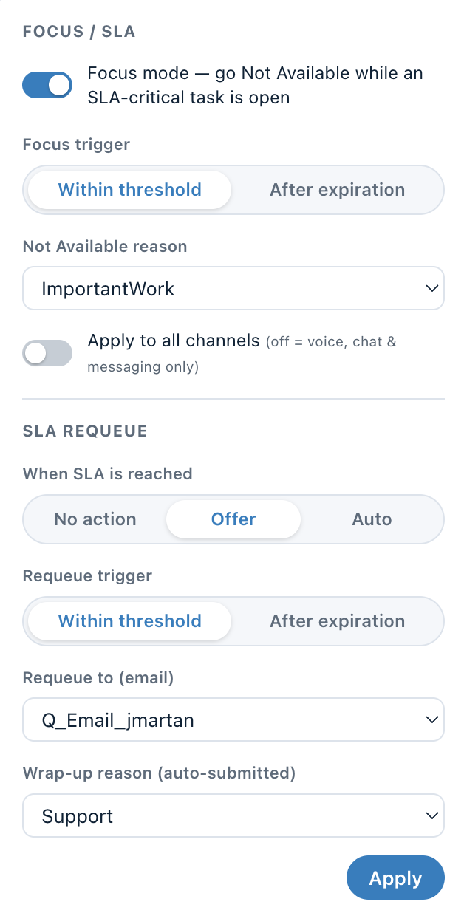
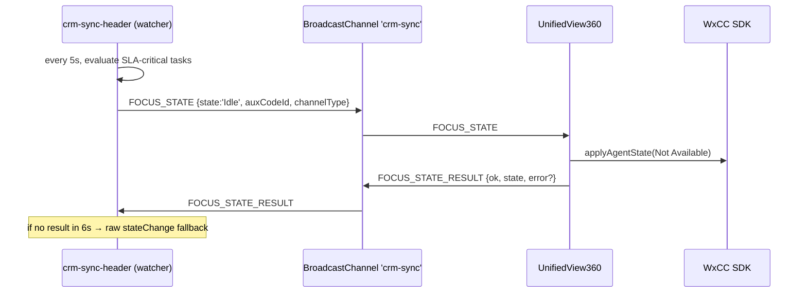

# SLA Focus Mode & End‑of‑Shift Requeue

Focus Mode keeps agents on their most time‑critical work: when an email task is
at (or near) its SLA, the agent is automatically set **Not Available** so no new
tasks are routed until the critical task is finished. When the pressure clears,
the agent is returned to **Available**. An optional **end‑of‑shift** action
requeues any remaining SLA tasks to a configured queue.

The feature spans three places:

| Piece | File | Role |
|---|---|---|
| Header watcher | [src/crm-sync-header.js](../src/crm-sync-header.js) | Central SLA tick loop, settings panel, end‑shift button; decides when to engage/release. |
| Customer 360 delegate | [src/views/UnifiedView360.jsx](../src/views/UnifiedView360.jsx) | Receives focus requests and performs the actual agent state change via the SDK. |
| Settings thunk | [src/store/slices/settingsSlice.js](../src/store/slices/settingsSlice.js) | `applyAgentState()` — the SDK‑backed state‑change implementation. |



---

## How it works



1. The watcher runs a 5‑second tick that checks whether **any** active task is
   SLA‑critical (within the imminent threshold, or already past expiry).
2. If focus mode is enabled and a critical task exists, it posts a `FOCUS_STATE`
   message on the `crm-sync` BroadcastChannel.
3. Customer 360 performs the state change via the SDK and posts back a
   `FOCUS_STATE_RESULT`.
4. If no result arrives within 6 seconds, the watcher falls back to a direct raw
   state change (`_stateChangeDirect`).
5. When the critical task clears, the watcher releases the agent back to
   Available (unless the agent manually took control — see [Overrides](#overrides)).

---

## Channel scope

A toggle in the settings panel controls **which channels** the Not Available
state applies to (`focus.channels`):

| Toggle | `channels` | Channel set |
|---|---|---|
| Off — real‑time only | `realtime` | `telephony`, `chat`, `customMessaging` |
| On — all channels | `all` | `telephony`, `chat`, `email`, `social`, `workItem`, `customMessaging` |

The mapping lives in `_channelsFor(mode)` in the watcher.

### Why a raw service call is used

The bundled `@wxcc-desktop/sdk` (v2.0.15) validates channel types against only
`['telephony','chat','email','social']` and its `stateChangeByChannelType` is not
implemented. To include `workItem` and `customMessaging`, `applyAgentState()`
calls the **raw** routing service first:

```js
window.AGENTX_SERVICE.aqm.agent.stateChangeV2({
  data: { state, auxCodeId, channelType }
});
```

It then falls back to the jsapi `stateChangeV2` (channel list filtered to the
four SDK‑safe channels), and finally to the v1 `stateChange`.

> ⚠️ Granular‑state‑control orgs (`isGranularStateChangeEnabled: true`) require
> `stateChangeV2` — the v1 `stateChange` fails with "Internal System Error"
> (reasonCode 33). The state payload uses a **singular** `auxCodeId`, not
> `auxCodeIdArray`, plus a `channelType[]` array. `auxCodeId` is required even
> for the Available transition (use `'0'`).

---

## Idle (Not Available) codes

- The catalog of idle/wrap‑up codes/queues is provisioned by
  `provisionSlaCatalog` and stored in localStorage.
- **System codes** (`isSystem: true`, e.g. `Calling_Restriction`) are filtered
  out — they cannot be set manually and cause reasonCode 33.
- If the configured idle code is stale/invalid, the watcher self‑heals to the
  org default (`isDefault`) idle code.

---

## End‑of‑shift requeue

The **End shift** button in the header requeues every open task that still has an
SLA to the configured queue, using `aqm.contact.vteamTransfer`. A confirmation
dialog is shown first, and an `END_SHIFT_RESULT` message reports how many tasks
were requeued.

---

## Settings & persistence

Settings are edited in the in‑header panel and persisted to `localStorage`
(per‑agent keys):

| Key prefix | Stores |
|---|---|
| `wx_c360_focus_{agentId}` | `{ enabled, triggerOn, idleCode:{id,name}, channels }` |
| `wx_c360_settings_{agentId}` | `{ sla: { action, triggerOn, autoCountdownSec, queues, wrapUp } }` |
| `wx_c360_catalog_{agentId}` | `{ idleCodes, queues, wrapUpCodes }` |

Changing settings broadcasts `SLA_SETTINGS_CHANGED` so Customer 360 re‑hydrates.

---

## Overrides

If the agent manually changes their own state while focus mode has them Not
Available, the watcher records an override and stops fighting the agent until the
SLA pressure clears. A short cooldown after a failed attempt prevents rapid
ret/ries.

---

## BroadcastChannel message types (`crm-sync`)

| Type | Direction | Payload |
|---|---|---|
| `FOCUS_STATE` | watcher → Customer 360 | `{ state, auxCodeId, name, channelType }` |
| `FOCUS_STATE_RESULT` | Customer 360 → watcher | `{ ok, state, error? }` |
| `SLA_SETTINGS_CHANGED` | watcher → Customer 360 | (none; triggers re‑hydrate) |
| `SELECT_INTERACTION` | watcher → Customer 360 | `{ interactionId }` |

---

## Localization of the panel

The watcher is copied **raw** (not bundled), so it can't import the React
`translations.js`. It carries a small inline dictionary (`_SLA_I18N`) + `_t()` +
`_slaLocale()`. Locale is detected from the `crm-sync-header` / `task-management`
element's `locale` attribute, then `navigator.language`, falling back to `en`.
The entire settings panel, end‑shift dialog, and header pill tooltips/labels are
localized (en / de / cs). When adding a locale to `src/i18n/translations.js`,
mirror the same keys into `_SLA_I18N`.

---

## Related docs

- [CRM integration](crm-integration.md) — the watcher, relay, and Tab Manager it belongs to.
- [Task Management widget](task-management-widget.md).
