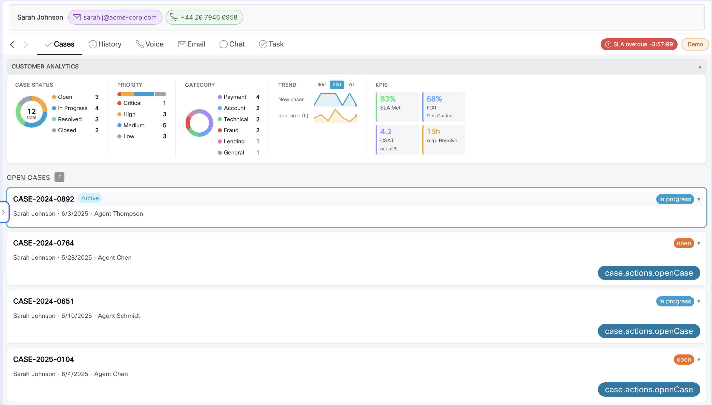
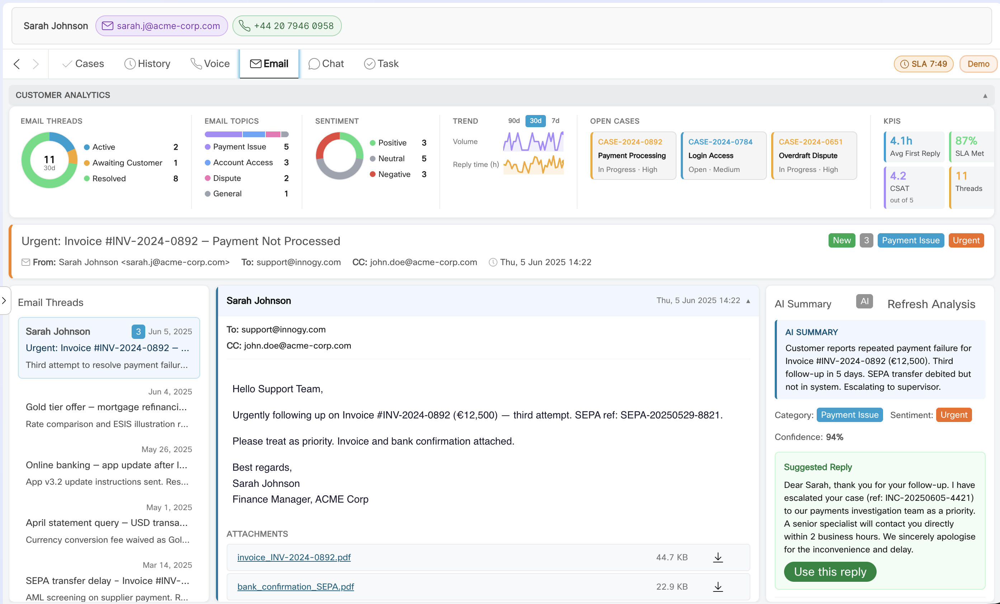

# Task Management Widget

A Webex Contact Center Desktop widget for managing tasks (cases) across all
digital channels — email, chat, voice — plus a unified customer view and
AI‑assisted hints. Built with React, Redux Toolkit, Momentum UI, and deployed as
a Web Component (shadow DOM).

- **Web Component tag:** `task-management-widget`
- **Entry:** [src/index.jsx](../src/index.jsx)
- **Main component:** [src/TaskManagement.jsx](../src/TaskManagement.jsx)
- **Standalone artifact:** `dist/task-management-standalone.js`

---

## Features

| Feature | Description |
|---|---|
| **Cases view** | List and detail editor for cases assigned to the agent; inline status, notes, and customer‑data editing. |
| **History view** | JDS‑sourced customer journey timeline. |
| **Email widget** | Three‑column layout: thread list, reading pane, reply composer (TipTap rich text), AI suggestions rail, and wrap‑up dialog. |
| **Chat widget** | Multi‑channel conversation list (Webchat, WhatsApp, SMS, Apple Messages, RCS, In‑App), live transcript, and AI rail. |
| **Voice widget** | Call history, live transcript, AI summary, and action suggestions. |
| **Unified Customer 360** | Cross‑channel customer view (`UnifiedView360`); also hosts the SLA focus‑mode delegate and requeue controller. |
| **AI integration** | Contextual hints and summaries via a configurable AI provider ([src/ai/](../src/ai/)). |
| **Demo mode** | Works without the Desktop SDK; safe fallbacks for local development. |
| **Dark mode** | Full `md--dark` theme support using CSS design tokens. |
| **Localization** | English, German, Czech (see [i18n](#i18n)). |





---

## Views and channels

### Single‑column tab views ([src/views/](../src/views/))

| View | File | Shows |
|---|---|---|
| Cases | [CasesView.jsx](../src/views/CasesView.jsx) | Agent's assigned cases with inline editing + a `CasesAnalyticsBar`. |
| History | [HistoryView.jsx](../src/views/HistoryView.jsx) | JDS customer journey timeline + a `HistoryAnalyticsBar`. |
| Chat | [ChatView.jsx](../src/views/ChatView.jsx) | Multi‑channel chat conversation surface. |
| Customer 360 | [UnifiedView360.jsx](../src/views/UnifiedView360.jsx) | Unified customer view; hosts the SLA focus delegate + `SlaRequeueController`. |

Single‑column views use the `.view-panel` root class.

### Multi‑column channel widgets

- **Email** — [src/email/](../src/email/): `EmailWidget.jsx`, `EmailTaskHeader.jsx`, `SlaCountdown.jsx`, `SlaRequeueController.jsx`.
- **Chat** — [src/chat/](../src/chat/).
- **Voice** — [src/voice/](../src/voice/).

Channel widgets use the `.widget-shell` root class. Layout and spacing are driven
entirely by `--tm-*` tokens in [src/ui/widget-layout.css](../src/ui/widget-layout.css).

---

## State management

All async operations (Desktop SDK, backend API, JDS) run through Redux thunks —
components only dispatch actions and read selectors.

| Slice | File | Responsibility |
|---|---|---|
| Widget | [store/slices/widgetSlice.js](../src/store/slices/widgetSlice.js) | Core agent/task/context state. |
| Email | [store/slices/emailSlice.js](../src/store/slices/emailSlice.js) | Email threads, composer, wrap‑up. |
| Settings | [store/slices/settingsSlice.js](../src/store/slices/settingsSlice.js) | Per‑agent settings + SDK‑backed `applyAgentState` thunk (see [SLA Focus Mode](sla-focus-mode.md)). |

- Store wiring: [src/store.js](../src/store.js)
- Pure API layer (no Redux): [src/api.js](../src/api.js)
- Desktop SDK guard / global shims: [src/agentx-globals.js](../src/agentx-globals.js)

---

## Props (Desktop Layout attributes)

The web component reads these attributes/properties (observed attributes include
`darkmode`, `accesstoken`, `orgid`, `datacenter`, `locale`, `tasktype`, `email`,
`view` — see [src/index.jsx](../src/index.jsx)):

| Attribute | Purpose |
|---|---|
| `accesstoken` | Webex bearer token for API/JDS calls. |
| `orgid` | Webex org UUID. |
| `datacenter` | Regional datacenter (e.g. `prodeu1`). |
| `locale` | UI locale (`en` / `de` / `cs`); falls back to browser detection. |
| `tasktype` | Which channel/view to render. |
| `darkmode` | Boolean; toggles `md--dark` theme. |
| `view` | View selector for standalone/harness mounting. |

Structured props may arrive as JSON strings — the widget parses them defensively.

---

## Demo mode

When the Desktop SDK is unavailable (local dev), the widget initializes safe
defaults and serves data from [src/mock/](../src/mock/). This keeps the dev
harness ([dev.html](../dev.html)) fully functional without a live Desktop
session. Never call the SDK directly from component lifecycle hooks; always guard
availability and fall back to demo data in the thunk layer.

---

## i18n

- Translation dictionaries: [src/i18n/translations.js](../src/i18n/translations.js)
- Provider/hook: [src/i18n/I18nContext.jsx](../src/i18n/I18nContext.jsx) (`useI18n()`)
- Supported locales: **en**, **de**, **cs**. Every key must exist in all locales.
- Components render text via i18n lookup — no hardcoded strings in JSX.

---

## Build & deploy

```bash
npm run build:standalone   # → dist/task-management-standalone.js
```

The standalone build also inlines Momentum fonts and copies the headless helpers
(`panel-layout-headless.js`, `crm-sync-header.js`, `activity-emitter.js`) into
`dist/`. Full build/deploy details for every widget are in
[development.md](development.md).

---

## Related docs

- [SLA Focus Mode](sla-focus-mode.md) — the focus/requeue behavior hosted in Customer 360 + the header watcher.
- [CRM integration](crm-integration.md) — how tasks sync to the CRM Tab Manager and click‑to‑call.
- [Development & deployment](development.md).
